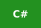

# 💫 Welcome to my development ecosystem!

  

  

## 💻 Tech Stack

  

  
  
  
  
  
  
  
  
  
  

  

  
  
  
  
  
  

  

  
  
  
  

  

  
  
  
  
  
  
  

  

  
  

  

  
  
  
  
  
  

  

  
  
  

## 💰 Support Me

